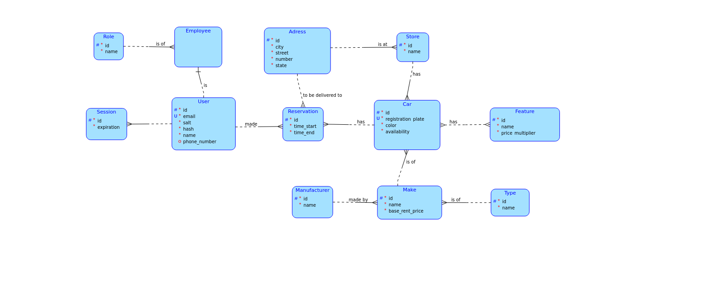

## Business operace klienta

 - Každý může prohlížet auta a může k vyhledávání přidat filtry (požadovaný časový interval, druh auta, výrobce, ...)
 - Přihlášený uživatel může rezervovat dostupné auto pro zadaný časový interval (dostupné = není kolize s jinou rezervací stejného auta a je na pronajmutí). Svoje rezervace může před začátkem pozměnit, či zrušit.
 - Přihlášený zaměstnanec se může přidávat, měnit či odebírat auta, měnit ostatní uživatele, apod.

## Datový model

 - V případě, že [diagram.png](./diagram.png) nelze zobrazit, lze otevřít soubor [diagram-model.json](./diagram-model.json) v aplikaci [BI-DBS Data modeller](https://dbs.fit.cvut.cz/dbsdm/)
 - Many-to-many: car-feature

## Komplexní dotaz navíc

Kontrola dostupnosti auta pro daný časový interval

